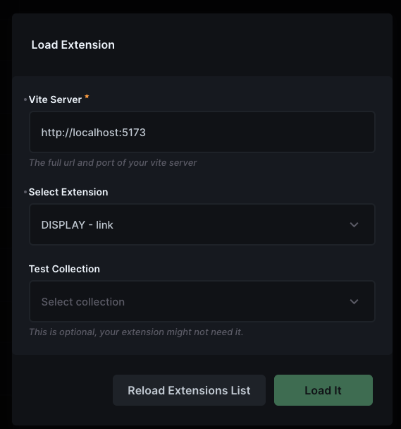
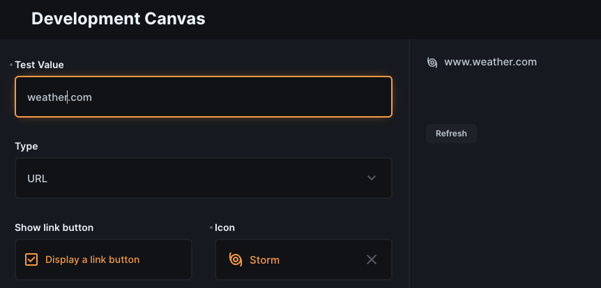

# Directus Extension Dev Canvas

A module for developing Directus UI extensions with **hot-reloading**.

| Edit bundled or single extensions | Edit displays with live setup options |
| -------- | ------- |
|  |  |

## 1 Setup

First install this extension in your Directus project:

### NPM Package

```bash
npm install directus-extension-dev-canvas -S
```

### Docker

Follow the [official Directus extension installation guide](https://docs.directus.io/extensions/installing-extensions.html) for Docker-based installations.

## 2 Configuration

**In your custom extension that you are developing follow these steps carefully:**

1. Add a file `vite.config.js` (`vite.config.ts` if using typescript), to the root of your extension with the following content:

```ts
import vue from '@vitejs/plugin-vue';
import { defineConfig } from 'vite';

// Update this with your Directus URL
const HOST_URL = 'http://localhost:8080';
const LOAD_IN_HOST = true;
// Update this with the correct values
// Current values are for a Directus 11.4.0
const HOST_DEPS = {
  "@directus/extensions-sdk": `${HOST_URL}/admin/assets/@directus_extensions-sdk.BUQzFEMG.entry.js`,
  "pinia": `${HOST_URL}/admin/assets/pinia.CcPPvUKL.entry.js`,
  "vue-i18n": `${HOST_URL}/admin/assets/vue-i18n.BDgO9r8I.entry.js`,
  "vue-router": `${HOST_URL}/admin/assets/vue-router.Y6owf-Uq.entry.js`,
  "vue": `${HOST_URL}/admin/assets/vue.Di93ddbl.entry.js`
};

export default defineConfig({
	plugins: [vue()],
	server: {
		cors: true,
	},
	resolve: {
		alias: {
			...(LOAD_IN_HOST ? HOST_DEPS : undefined),
		},
		extensions: ['.mjs', '.js', '.ts', '.jsx', '.tsx', '.json', '.vue', '.d.ts'],
	},
});
```

2. **IMPORTANT STEP**: The HOST_DEPS in the vite.config.ts file is a list of shared dependencies that need to be loaded from Directus. Every version of Directus contains different hash values, so you need to update the HOST_DEPS with the correct values now and every time you upgrade Directus. To help there is a script that you can run at the root of your Directus Project to print out the correct values.

```bash
node ./node_modules/directus-extension-dev-canvas/host-deps.js
> Copy the output and paste it as the value of HOST_DEPS into your vite.config.ts file
```

> NOTE: Also update the HOST_URL with the correct URL of your Directus instance.

3. Add the following to your extension's `package.json` file:
```json
"scripts": {
	"start": "vite"
}
```

4. Start the vite server for your extension with `npm start`

## 3 Final Steps

In your Directus project, follow these steps:

1. Edit your environment variables to include the following:
```
CONTENT_SECURITY_POLICY_DIRECTIVES__SCRIPT_SRC="'self' 'unsafe-eval' http://localhost:5173"
CONTENT_SECURITY_POLICY_DIRECTIVES__CONNECT_SRC="'self' https://* wss://* http://localhost:5173 ws://localhost:5173"
```
> Note: The port 5173 is the default port for Vite, if you are using a different port, please replace it with your port.


2. Start up your Directus instance, and navigate to the Developer Canvas module in the sidebar.
> You might have to enable the module in the settings first time you load it.

3. Update if needed the the URL of the running vite server

4. If it is a bundle, select the extension you want to work on.

4. Click **"Load It"**, and your extension should now be loaded in the Developer Canvas module.

## Note

- The Developer Canvas module is only available to users with the `admin_access` permission.

- You still need to manually run `npm run build` to actually bundle your extension once you want to use it outside of the Developer Canvas module.

## Supported UI Extension Types

- ✅ Bundles
- ✅ Modules
- ✅ Layouts
- 🔰 Displays
- 🔰 Interfaces

🔰 = Works for simple extensions, but not those with relationships.

# Known Issues

>Console error: `Refused to connect to [URL]because it violates the document's Content Security Policy.`
>
> Check step 3.1 of the installation instructions.


> Error: `Failed to fetch dynamically imported module`:
>
> Ensure the vite server is running and the URL is correct.


## Contributing

Contributions are welcome! Please feel free to submit a Pull Request.

### Contributors:

 - YOUR NAME HERE ;)

## License

If you are developing an open source extension for Directus that you plan to share with the community, you must use the GNU Affero General Public License v3.0. If you are developing an extension commercial organization or a client, you must purchase a commercial license.

> Note: This software is provided as-is, without any warranty. The original author is not liable for any damages or losses incurred while using this software.

Read the entire license agreement here [LICENSE.md](LICENSE.md)

Copyright (c) 2025 Gerard Lamusse
